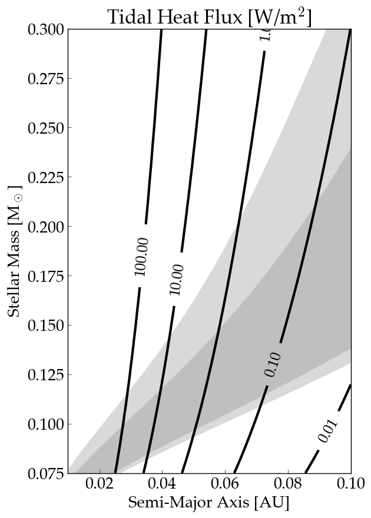

HZTideHeat
==========

Surface energy flux on a terrestrial exoplanet in the habitable zone (HZ) due to tidal dissipation according the the eqtide-CPL
model from `vplanet <https://github.com/VirtualPlanetaryLaboratory/vplanet>`_.

===================   =========
**Date**              12/15/18
**Author**            Rory Barnes
**Modules**           eqtide
**Approx. runtime**   3 minutes
**Source code**       `vplanet <https://github.com/VirtualPlanetaryLaboratory/vplanet>`_, `vplot <https://github.com/VirtualPlanetaryLaboratory/vplot>`_
===================   =========

This example calculates the surface energy flux on a 1 Earth-mass, 1 Earth-radius terrestrial exoplanet that is tidally locked and 
has a tidal Q of 12 and an eccentricity of 0.05. It requires `vplanet` and it supporting software packages `vspace` (part of `vplanet`)
and `vplot <https://github.com/VirtualPlanetaryLaboratory/vplot>`_. 

To run this code and generate a figure
-------------------

.. code-block:: bash

   vspace vspace.in
   python makeplot.py <pdf | png>
   

Expected output
---------------

